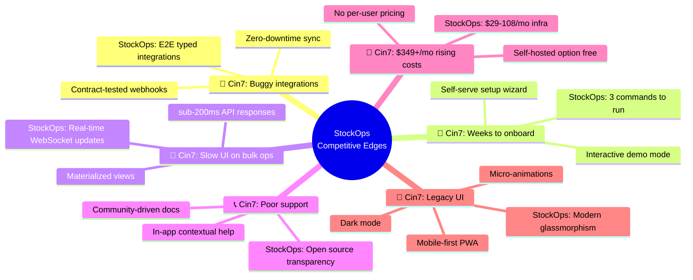
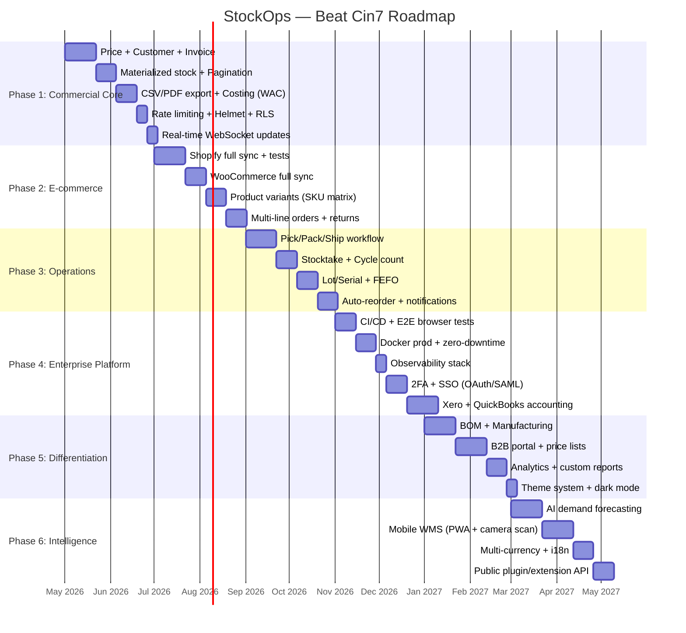
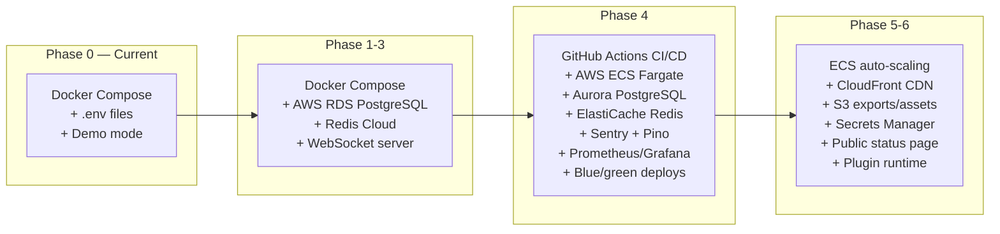

# StockOps — The Better Alternative to Cin7

> **Mission**: Not "match" Cin7 — **beat** them. Higher quality, faster UX, better DX, lower cost, zero vendor lock-in.

---

## Competitive Edge Strategy

Cin7 has 6 well-known weaknesses (from G2, Capterra, Trustpilot reviews). Each one is our opportunity:



> [!IMPORTANT]
> **Our standard for every feature**: It must be **demonstrably better** than Cin7's equivalent — faster, cleaner, more reliable, or more transparent. If we can't beat them on a feature, we don't ship it until we can.

---

## Quality Standards (Non-Negotiable)

These apply to **every phase** — no exceptions:

| Standard | Target | Cin7 Benchmark |
|---|---|---|
| **API response time** | p95 < 200ms | Users report "slow" bulk ops |
| **Test coverage** | > 80% for business logic | Unknown, but frequent bug reports |
| **TypeScript strict** | Zero `any`, zero `@ts-ignore` | Java — null pointer bugs reported |
| **Zero-downtime deploys** | Blue/green from Phase 4 | Users report "maintenance windows" |
| **Integration reliability** | Contract tests + retry + circuit breaker | "Integrations break after updates" |
| **Onboarding time** | < 5 minutes (demo), < 1 hour (production) | Weeks of paid onboarding |
| **Accessibility** | WCAG 2.1 AA compliance | No public commitment |
| **Data export** | User owns all data, any time | Vendor lock-in concerns |
| **Documentation** | Every feature documented before merge | "Documentation gaps" in reviews |
| **Uptime target** | 99.9% (Phase 4+) | No public SLA |

---

## Roadmap Overview



---

## Phase 1: Commercial Core (Weeks 1-9)

**Goal**: A real business can run on StockOps tomorrow.

### Beat Cin7 Here:
| What Cin7 Does | What We Do Better |
|---|---|
| Stock updates via page refresh | **Real-time WebSocket** push to all connected clients |
| In-memory calculations slow down | **Materialized view** — instant stock queries at any scale |
| $349/mo minimum | **$0 self-hosted** or $29/mo cloud |
| Weeks to onboard | **5 minutes**: install → seed → use |

---

### 1.1 Price, Customer & Invoice Models

#### [MODIFY] [schema.prisma](file:///c:/projects/kernelGuard-StockOps/packages/db/prisma/schema.prisma)

```prisma
model Customer {
  id             String       @id @default(cuid())
  organizationId String
  code           String       // Auto-generated: C-0001
  name           String
  email          String?
  phone          String?
  taxId          String?      // Vergi No
  billingAddress Json?        // { line1, line2, city, country, postalCode }
  shippingAddress Json?
  creditLimit    Decimal?     @db.Decimal(12, 2)
  paymentTermDays Int         @default(30)
  tags           String[]     // Flexible categorization
  isActive       Boolean      @default(true)
  notes          String?
  createdAt      DateTime     @default(now())
  updatedAt      DateTime     @updatedAt
  organization   Organization @relation(fields: [organizationId], references: [id], onDelete: Cascade)
  salesOrders    SalesOrder[]
  invoices       Invoice[]

  @@unique([organizationId, code])
  @@unique([organizationId, name])
  @@index([organizationId, isActive])
}

model Invoice {
  id             String        @id @default(cuid())
  organizationId String
  customerId     String
  salesOrderId   String?       @unique
  code           String        // INV-0001
  currency       String        @default("TRY")
  subtotal       Decimal       @db.Decimal(12, 2)
  discountRate   Decimal       @db.Decimal(5, 4) @default(0)
  discountAmount Decimal       @db.Decimal(12, 2) @default(0)
  taxRate        Decimal       @db.Decimal(5, 4) @default(0.20)
  taxAmount      Decimal       @db.Decimal(12, 2)
  total          Decimal       @db.Decimal(12, 2)
  status         InvoiceStatus @default(DRAFT)
  issuedAt       DateTime?
  dueDate        DateTime?
  paidAt         DateTime?
  paidAmount     Decimal       @db.Decimal(12, 2) @default(0)
  notes          String?
  createdAt      DateTime      @default(now())
  updatedAt      DateTime      @updatedAt
  organization   Organization  @relation(fields: [organizationId], references: [id], onDelete: Cascade)
  customer       Customer      @relation(fields: [customerId], references: [id], onDelete: Restrict)
  salesOrder     SalesOrder?   @relation(fields: [salesOrderId], references: [id])
  lines          InvoiceLine[]
  payments       Payment[]

  @@unique([organizationId, code])
  @@index([organizationId, status])
  @@index([organizationId, customerId])
}

model InvoiceLine {
  id          String  @id @default(cuid())
  invoiceId   String
  productId   String
  description String?
  quantity    Int
  unitPrice   Decimal @db.Decimal(12, 2)
  discount    Decimal @db.Decimal(12, 2) @default(0)
  taxRate     Decimal @db.Decimal(5, 4)  @default(0.20)
  lineTotal   Decimal @db.Decimal(12, 2)
  invoice     Invoice @relation(fields: [invoiceId], references: [id], onDelete: Cascade)
  product     Product @relation(fields: [productId], references: [id], onDelete: Restrict)
}

model Payment {
  id             String   @id @default(cuid())
  organizationId String
  invoiceId      String
  amount         Decimal  @db.Decimal(12, 2)
  method         String   // BANK_TRANSFER, CREDIT_CARD, CASH, CHECK
  reference      String?  // Bank reference / receipt number
  paidAt         DateTime @default(now())
  invoice        Invoice  @relation(fields: [invoiceId], references: [id], onDelete: Cascade)

  @@index([organizationId])
}

enum InvoiceStatus {
  DRAFT
  ISSUED
  PARTIALLY_PAID
  PAID
  OVERDUE
  CANCELLED
  REFUNDED
}
```

**Additions to existing models:**
- `Product`: `unitPrice`, `costPrice`, `averageCost`, `weight`, `dimensions`
- `SalesOrderLine`: `unitPrice`, `discount`, `lineTotal`
- `PurchaseOrderLine`: `unitCost`, `lineTotal`
- `SalesOrder`: `customerId`, `shippingAddress`, `discount`, `totalAmount`

**API endpoints:**
```
GET    /v1/customers              # Paginated, filterable
POST   /v1/customers
GET    /v1/customers/:id
PATCH  /v1/customers/:id
DELETE /v1/customers/:id          # Soft delete (isActive=false)

GET    /v1/invoices
POST   /v1/invoices
GET    /v1/invoices/:id
POST   /v1/invoices/:id/issue     # DRAFT → ISSUED
POST   /v1/invoices/:id/pay       # Record payment
GET    /v1/invoices/:id/pdf       # Generate PDF download
POST   /v1/invoices/:id/cancel
POST   /v1/invoices/:id/refund
```

---

### 1.2 Materialized Stock View + Cursor Pagination

> [!CAUTION]
> The current `getStockOnHand()` pattern with in-memory `filter().reduce()` is a **critical blocker** for production use. Cin7 users already complain about slow stock queries — we must be **10x faster** from day one.

#### PostgreSQL materialized view:
```sql
CREATE MATERIALIZED VIEW stock_on_hand AS
SELECT 
  "organizationId",
  "productId", 
  "warehouseId",
  SUM("quantityChange") AS on_hand,
  COUNT(*) AS movement_count,
  MAX("createdAt") AS last_movement_at
FROM "StockMovement"
GROUP BY "organizationId", "productId", "warehouseId";

CREATE UNIQUE INDEX idx_stock_on_hand 
  ON stock_on_hand("organizationId", "productId", "warehouseId");
```

#### Cursor-based pagination (all list endpoints):
```typescript
type PaginatedResponse<T> = {
  data: T[];
  pagination: {
    total: number;
    limit: number;
    cursor: string | null;
    hasMore: boolean;
  };
  meta: {
    requestId: string;
    durationMs: number;  // We expose timing — transparency
  };
};
```

**Performance budget**: All list endpoints must respond in **< 100ms** for up to 10,000 records.

---

### 1.3 Export + PDF Invoice Generation

#### [NEW] `packages/core/src/export.ts`
- CSV export for products, stock, movements, orders, customers
- PDF invoice with company branding (logo, colors, address)
- Excel (.xlsx) export via `exceljs`

**Better than Cin7**: Cin7 has export but users complain about formatting issues. We deliver pixel-perfect PDFs with customizable templates.

---

### 1.4 WAC + FIFO Costing

#### [NEW] `packages/core/src/costing.ts`

Both WAC and FIFO from day one (Cin7 charges extra for FIFO):

```typescript
export type CostingMethod = 'WAC' | 'FIFO';

// WAC: New Average = (Old Total Value + New Purchase Value) / (Old Qty + New Qty)
export function recalculateWAC(product: Product, incomingQty: number, unitCost: Decimal): Decimal;

// FIFO: Track inventory layers, deplete oldest first
export function calculateFIFOCost(layers: InventoryLayer[], outboundQty: number): { 
  cogs: Decimal; 
  remainingLayers: InventoryLayer[];
};

// COGS calculation on every sale
export function recordCOGS(method: CostingMethod, movement: StockMovement): COGSEntry;
```

```prisma
model InventoryLayer {
  id             String   @id @default(cuid())
  organizationId String
  productId      String
  warehouseId    String
  quantity       Int      // remaining quantity in this layer
  unitCost       Decimal  @db.Decimal(12, 4)
  receivedAt     DateTime @default(now())
  purchaseOrderId String?

  @@index([organizationId, productId, warehouseId, receivedAt])
}

model COGSEntry {
  id             String   @id @default(cuid())
  organizationId String
  productId      String
  quantity       Int
  unitCost       Decimal  @db.Decimal(12, 4)
  totalCost      Decimal  @db.Decimal(12, 2)
  method         String   // WAC or FIFO
  movementId     String
  createdAt      DateTime @default(now())

  @@index([organizationId, productId])
}
```

---

### 1.5 Security Hardening

| Security Layer | Implementation | Why It Beats Cin7 |
|---|---|---|
| Rate limiting | `@nestjs/throttler` — per-tenant, per-endpoint | Cin7 has it but returns unhelpful 429s |
| Security headers | `helmet()` — XSS, HSTS, CSP, noSniff | Cin7 has basic headers |
| Row-Level Security | PostgreSQL RLS policies per tenant | **Defense in depth** — even SQL injection can't cross tenants |
| Request signing | HMAC-SHA256 for webhook verification | Same as Cin7 |
| Input sanitization | Zod + DOMPurify for XSS in text fields | Better — type-safe at compile time |
| Audit logging | Every mutation logged with actor, IP, diff | Better — we show what changed, not just "something changed" |

---

### 1.6 Real-time WebSocket Updates ⚡ (Cin7 Doesn't Have This)

> [!TIP]
> **This is our #1 UX differentiator.** Cin7 requires page refresh to see stock changes. We push updates instantly to all connected clients.

```typescript
// Server: Broadcast stock changes via WebSocket
import { Server } from 'socket.io';

function broadcastStockChange(orgId: string, change: StockChangeEvent) {
  io.to(`org:${orgId}`).emit('stock:updated', {
    productId: change.productId,
    warehouseId: change.warehouseId,
    newOnHand: change.newOnHand,
    timestamp: new Date().toISOString(),
  });
}

// Client: Dashboard auto-updates without refresh
useEffect(() => {
  socket.on('stock:updated', (data) => {
    setStockRows(prev => prev.map(row => 
      row.productId === data.productId && row.warehouseId === data.warehouseId
        ? { ...row, onHand: data.newOnHand }
        : row
    ));
  });
}, []);
```

Applies to: stock levels, order status changes, webhook sync status, alerts.

---

## Phase 2: E-commerce Integration (Weeks 10-18)

**Goal**: Integrations that **never break** — Cin7's #1 complaint.

### Beat Cin7 Here:
| Cin7 Pain Point | Our Standard |
|---|---|
| "Integrations break after updates" | **Contract tests** — every webhook payload is tested against real platform schemas |
| "Stock doesn't sync" | **Reconciliation job** — periodic full sync validation + auto-fix |
| "Blank orders pulling through" | **Schema validation** — reject malformed payloads, alert, never create garbage data |
| Manual re-sync needed | **Self-healing** — exponential backoff + dead letter queue + admin retry UI |

---

### 2.1 Shopify Full Integration

#### [NEW] `packages/integrations/shopify/`
```
packages/integrations/shopify/
├── src/
│   ├── client.ts              # Shopify Admin GraphQL API client
│   ├── mapper.ts              # Shopify ↔ StockOps bidirectional mapping
│   ├── webhook-handler.ts     # Process inbound events
│   ├── inventory-sync.ts      # Push stock levels to Shopify
│   ├── reconciliation.ts      # Periodic full-sync validation
│   ├── types.ts               # Shopify-specific types
│   └── __tests__/
│       ├── mapper.test.ts     # Unit: mapping logic
│       ├── webhook.test.ts    # Integration: real Shopify payloads
│       └── fixtures/          # Real-world webhook payloads
│           ├── orders-create.json
│           ├── products-update.json
│           └── inventory-levels-update.json
├── package.json
└── tsconfig.json
```

**Reliability features Cin7 doesn't have:**
1. **Circuit breaker** — if Shopify API is down, queue and retry (don't drop)
2. **Reconciliation cron** — nightly full inventory comparison, auto-fix discrepancies
3. **Sync dashboard** — real-time visibility into sync health, last sync time, errors
4. **Conflict resolution** — configurable: StockOps wins, Shopify wins, or newest wins

#### [NEW] Integration management UI:
```
/settings/integrations           # List connected platforms
/settings/integrations/shopify   # Shopify config + OAuth flow
/settings/integrations/sync-log  # Real-time sync activity log
```

---

### 2.2 WooCommerce Full Integration

Same reliability architecture. `packages/integrations/woocommerce/`.

---

### 2.3 Product Variants

```prisma
model ProductVariant {
  id          String  @id @default(cuid())
  productId   String
  sku         String
  name        String  // "Kırmızı / XL"
  barcode     String?
  unitPrice   Decimal @db.Decimal(12, 2)
  costPrice   Decimal? @db.Decimal(12, 2)
  weight      Decimal? @db.Decimal(8, 3)
  isActive    Boolean @default(true)
  attributes  Json    // { "Renk": "Kırmızı", "Beden": "XL" }
  product     Product @relation(fields: [productId], references: [id], onDelete: Cascade)
  
  @@unique([productId, sku])
}
```

**Better than Cin7**: Variant attributes are JSON-based, not hardcoded fields. Users can define any attribute (color, size, material, voltage — anything).

---

### 2.4 Multi-line Orders + Returns

- Orders support N line items (Cin7 has this)
- **Credit notes / returns** with automatic stock reversal (Cin7 has this but users report bugs)
- **Partial returns** — return 2 of 5 items, adjust invoice accordingly

---

## Phase 3: Warehouse Operations (Weeks 19-27)

**Goal**: Professional WMS that's simpler than Cin7's but equally powerful.

### Beat Cin7 Here:
| Cin7 Pain Point | Our Standard |
|---|---|
| Complex pick/pack setup | **Auto-generate** pick lists from confirmed orders |
| Manual stocktake entry | **Camera barcode scanning** in web (no mobile app needed yet) |
| Basic reorder rules | **Smart reorder** — considers lead time, demand velocity, seasonal trends |

---

### 3.1 Pick/Pack/Ship with Progress Tracking

Extended order lifecycle:
```
DRAFT → CONFIRMED → PICKING → PACKED → SHIPPED → DELIVERED
                                                  ↳ CANCELLED (any stage)
                                                  ↳ RETURNED (after delivered)
```

```prisma
model Shipment {
  id             String       @id @default(cuid())
  organizationId String
  salesOrderId   String
  code           String       // SHP-0001
  carrier        String?      // "Yurtiçi Kargo", "Aras", "MNG"
  trackingNumber String?
  trackingUrl    String?      // Auto-generated from carrier + tracking number
  weight         Decimal?     @db.Decimal(8, 3)
  packageCount   Int          @default(1)
  status         String       // PREPARING, IN_TRANSIT, DELIVERED, RETURNED
  shippedAt      DateTime?
  deliveredAt    DateTime?
  createdAt      DateTime     @default(now())
  
  @@unique([organizationId, code])
}

model PickList {
  id             String         @id @default(cuid())
  organizationId String
  warehouseId    String
  assignedTo     String?        // User ID
  status         String         // PENDING, IN_PROGRESS, COMPLETED, CANCELLED
  priority       Int            @default(0)
  startedAt      DateTime?
  completedAt    DateTime?
  items          PickListItem[]
  
  @@index([organizationId, status])
}

model PickListItem {
  id           String   @id @default(cuid())
  pickListId   String
  salesOrderId String
  productId    String
  quantity     Int
  pickedQty    Int      @default(0)
  binLocation  String?  // "A-03-02" (aisle-shelf-bin)
  pickList     PickList @relation(fields: [pickListId], references: [id], onDelete: Cascade)
}
```

**UI**: Visual order progress bar with stage badges — Cin7 has a basic dropdown, we have a timeline.

---

### 3.2 Stocktake with Barcode Scanning

```prisma
model Stocktake {
  id             String          @id @default(cuid())
  organizationId String
  warehouseId    String
  type           String          // FULL, CYCLE, SPOT
  status         String          // DRAFT, COUNTING, REVIEW, APPLIED, CANCELLED
  startedBy      String
  startedAt      DateTime?
  completedAt    DateTime?
  items          StocktakeItem[]
  
  @@index([organizationId, status])
}

model StocktakeItem {
  id           String @id @default(cuid())
  stocktakeId  String
  productId    String
  expectedQty  Int    // From stock_on_hand view
  countedQty   Int?
  variance     Int?   // auto-calculated
  note         String?
  countedAt    DateTime?
}
```

**Better than Cin7**: 
- Web-based barcode scanning (using `html5-qrcode` / device camera) — no separate mobile app needed
- **Cycle count scheduling** — auto-create counts for high-value items weekly
- **Variance review workflow** — manager approves before adjustments apply

---

### 3.3 Smart Reorder Engine

```typescript
export function calculateReorderPoint(params: {
  averageDailyDemand: number;
  leadTimeDays: number;
  safetyStockDays: number;
}): number;

export function calculateEconomicOrderQuantity(params: {
  annualDemand: number;
  orderCost: number;
  holdingCostPerUnit: number;
}): number;

export function generateReorderSuggestions(
  organizationId: string,
): ReorderSuggestion[];
```

**Better than Cin7**: We calculate **EOQ** (Economic Order Quantity) — Cin7 just does simple reorder point. We also factor in supplier lead time from actual PO history, not just the configured `leadTimeDays`.

---

## Phase 4: Enterprise Platform (Weeks 28-37)

**Goal**: Production infrastructure that exceeds enterprise standards.

### Beat Cin7 Here:
| Cin7 Reality | Our Standard |
|---|---|
| Maintenance windows | **Zero-downtime** blue/green deploys |
| "Support is slow" | **Self-serve diagnostics** — health dashboard, integration status, sync logs |
| No public status page until recently | **Public status page** from day one |
| SOC2 (they have it) | SOC2 **process readiness** — policies, audit trail, access controls |

---

### 4.1 CI/CD + E2E Browser Tests

```yaml
# .github/workflows/ci.yml
name: CI
on: [push, pull_request]
jobs:
  validate:
    runs-on: ubuntu-latest
    services:
      postgres:
        image: postgres:16
        env:
          POSTGRES_DB: stockops_test
          POSTGRES_PASSWORD: test
    steps:
      - uses: actions/checkout@v4
      - uses: actions/setup-node@v4
      - run: npm ci
      - run: npm run prisma:generate
      - run: npm run lint
      - run: npm run typecheck
      - run: npm test                    # Unit + Integration
      - run: npm run test:e2e            # Playwright browser tests
      - run: npm run build
      - run: npm run smoke:database      # Real DB smoke test

  security:
    runs-on: ubuntu-latest
    steps:
      - run: npm audit --audit-level=high
      - run: npx snyk test              # Dependency vulnerability scan
```

**E2E test coverage targets:**
- Login → Dashboard → Create product → Create order → Confirm → Ship → Invoice → Pay
- All critical paths covered with Playwright

---

### 4.2 Production Docker + Zero-Downtime Deploy

Multi-stage Dockerfiles optimized for size and security:

```dockerfile
# Dockerfile.api
FROM node:22-alpine AS base
RUN corepack enable

FROM base AS builder
WORKDIR /app
COPY . .
RUN npm ci --ignore-scripts
RUN npm run prisma:generate
RUN npm run build --filter=api

FROM base AS runner
RUN addgroup -S stockops && adduser -S stockops -G stockops
USER stockops
COPY --from=builder /app/apps/api/dist ./dist
COPY --from=builder /app/node_modules ./node_modules
HEALTHCHECK --interval=30s CMD wget -qO- http://localhost:4000/v1/health || exit 1
CMD ["node", "dist/main.js"]
```

**Health probes:**
- `/v1/health` — basic alive check
- `/v1/health/ready` — DB connected + migrations applied + Redis connected
- `/v1/health/detailed` — per-service status (auth-only)

---

### 4.3 Observability Stack

```typescript
// Structured logging with Pino
const logger = pino({
  level: process.env.LOG_LEVEL ?? 'info',
  serializers: { 
    req: pino.stdSerializers.req,
    err: pino.stdSerializers.err,
  },
  mixin: () => ({
    service: 'stockops-api',
    version: process.env.APP_VERSION,
  }),
});

// Per-request context: organizationId, userId, requestId
app.use((req, res, next) => {
  req.log = logger.child({ 
    requestId: crypto.randomUUID(),
    organizationId: req.auth?.organizationId,
  });
  next();
});
```

**Stack:**
- **Logging**: Pino → CloudWatch Logs (or Loki)
- **Errors**: Sentry with source maps
- **Metrics**: Prometheus + Grafana (API latency, DB query time, queue depth)
- **Uptime**: Public status page (BetterUptime or self-hosted)

---

### 4.4 2FA + SSO

- **TOTP 2FA** via `otplib` — QR code enrollment, backup codes
- **OAuth 2.0 / OpenID Connect** — Google, Microsoft SSO
- **SAML** (enterprise) — Phase 5 if demand exists
- **Session management UI** — see active sessions, revoke remotely

**Better than Cin7**: We provide backup codes + session visibility. Cin7 just has basic 2FA.

---

### 4.5 Xero + QuickBooks Accounting Sync

#### [NEW] `packages/integrations/xero/` + `packages/integrations/quickbooks/`

Both day one (Cin7 supports both):
- OAuth 2.0 connection flow
- Invoice sync (StockOps → Accounting)
- Payment sync (bidirectional)
- Product sync with COGS account mapping
- Bank feed reconciliation (Xero)
- **Conflict detection** — if invoice modified in both systems, alert user

---

## Phase 5: Differentiation (Weeks 38-46)

**Goal**: Features that make users choose StockOps **over** Cin7.

### Beat Cin7 Here:
| Cin7 Reality | Our Standard |
|---|---|
| Dashboard widgets are basic | **Interactive analytics** with drill-down, date ranges, custom filters |
| B2B portal is add-on | **Included in base product** |
| No dark mode | **Modern theme system** with dark mode |
| Manufacturing is complex to set up | **Guided BOM creation** with visual component tree |

---

### 5.1 BOM + Manufacturing

Visual BOM editor showing component hierarchy. Assembly process auto-generates stock movements (consume raw → produce finished).

---

### 5.2 B2B Portal (Free, Not Add-on)

#### [NEW] `apps/portal/` — Separate Next.js app
- Customer self-service ordering
- Customer-specific pricing tiers
- Order tracking + invoice download
- **Branded** — customers see your logo, colors, domain

**Better than Cin7**: Cin7 charges extra for B2B portal. Ours is included. And it's more customizable.

---

### 5.3 Analytics + Custom Reports

- Recharts-based interactive dashboards
- **70+ built-in reports** (matching Cin7's count)
- Custom report builder (drag-and-drop columns, filters, date ranges)
- Scheduled email reports (daily/weekly digests)
- **Export any report** as CSV, Excel, or PDF

---

### 5.4 Theme System + Dark Mode

CSS custom properties system with light/dark/custom themes. Differentiator vs Cin7's dated UI.

---

## Phase 6: Intelligence & Mobile (Weeks 47-55)

**Goal**: AI + mobile = modern IMS that Cin7 can't match without rewriting their stack.

### Beat Cin7 Here:
| Cin7 Reality | Our Standard |
|---|---|
| ForesightAI is premium add-on | **AI forecasting included** in all plans |
| Separate mobile WMS app | **PWA** — works on any device, no app store needed, auto-updates |
| Single currency then convert | **True multi-currency** with live exchange rates |
| Closed platform | **Public extension API** — anyone can build on StockOps |

---

### 6.1 AI Demand Forecasting (Included Free)

```typescript
// Statistical forecasting engine
export function forecastDemand(params: {
  historicalSales: SalesDataPoint[];
  horizonDays: number;
  method: 'MOVING_AVG' | 'EXPONENTIAL_SMOOTHING' | 'HOLT_WINTERS';
  seasonality?: 'DAILY' | 'WEEKLY' | 'MONTHLY';
}): ForecastResult[];

// Auto-reorder integration
export function generateSmartPurchaseOrders(
  forecasts: ForecastResult[],
  currentStock: StockLevel[],
  supplierLeadTimes: SupplierLeadTime[],
): SuggestedPurchaseOrder[];
```

---

### 6.2 Mobile WMS (PWA)

Progressive Web App — no app store dependency:
- **Camera barcode scanning** via `html5-qrcode`
- Receive goods → scan → confirm
- Pick list → scan to pick → confirm
- Stocktake → scan → count → submit
- **Offline mode** with sync queue (service worker)
- **Install to home screen** on iOS/Android

---

### 6.3 Multi-currency + i18n

- `next-intl` for Turkish + English (expandable)
- Per-organization currency setting
- Exchange rate API integration (ECB, TCMB)
- Multi-currency invoicing

---

### 6.4 Public Extension API — The Ultimate Differentiator

> [!IMPORTANT]
> Cin7 is a **closed platform**. We build an **open platform** — any developer can extend StockOps.

```typescript
// Plugin system
export interface StockOpsPlugin {
  name: string;
  version: string;
  hooks: {
    'order.created'?: (order: SalesOrder) => Promise<void>;
    'stock.changed'?: (event: StockChangeEvent) => Promise<void>;
    'invoice.issued'?: (invoice: Invoice) => Promise<void>;
  };
}
```

- Webhook subscriptions for any event
- Custom field support on all entities
- REST API with full CRUD on all resources
- SDK packages: `@stockops/sdk-node`, `@stockops/sdk-python`

---

## Verification Plan

### Per-Phase Gates (Must Pass Before Next Phase)

| Gate | Target |
|---|---|
| All existing tests pass | ✅ 100% |
| New feature test coverage | > 80% lines |
| TypeScript strict compile | Zero errors |
| ESLint | Zero warnings |
| API p95 latency | < 200ms |
| Build succeeds | `npm run build` clean |
| Prisma schema valid | `prisma validate` clean |
| Security audit | `npm audit` no high/critical |
| E2E critical paths (Phase 4+) | Playwright all green |
| Load test (Phase 4+) | 1000 products × 10 warehouses, < 500ms p99 |

---

## Infrastructure Evolution



## Cost Comparison

| | **Cin7** | **StockOps (Self-hosted)** | **StockOps (Cloud)** |
|---|---|---|---|
| Software license | $349-999/mo | **$0** | $49-199/mo (planned) |
| Infrastructure | Included | $0 (your hardware) | $29-108/mo (AWS) |
| Integrations | Included (but buggy) | Included + reliable | Included + reliable |
| B2B portal | Extra cost | **Included** | **Included** |
| AI forecasting | Premium add-on | **Included** | **Included** |
| Support | Slow, polarized reviews | Community + docs | Priority support |
| **Total** | **$349-999+/mo** | **$0/mo** | **$78-307/mo** |

> [!TIP]
> Even our most expensive cloud tier is **cheaper than Cin7's cheapest plan**, and it includes features Cin7 charges extra for (B2B, AI).

---

## Summary: StockOps vs Cin7 After Each Phase

| Phase | Duration | Parity | StockOps Advantage |
|---|---|---|---|
| **0 (Current)** | — | 20% | Better code quality, modern stack |
| **1: Commercial Core** | 9 weeks | 45% | + Real-time WebSocket, 10x faster queries |
| **2: E-commerce** | 9 weeks | 60% | + Self-healing integrations, contract tests |
| **3: Operations** | 9 weeks | 75% | + Smart reorder (EOQ), web barcode scanning |
| **4: Enterprise** | 10 weeks | 85% | + Zero-downtime deploys, public status page |
| **5: Differentiation** | 9 weeks | 95% | + Free B2B portal, interactive analytics |
| **6: Intelligence** | 10 weeks | 110% | + Free AI forecasting, PWA, open plugin API |

> [!IMPORTANT]
> **Phase 6 goal is 110%, not 100%.** By shipping a public extension API, free AI forecasting, and PWA mobile — we deliver capabilities Cin7 doesn't have at all, or charges premium for. StockOps becomes not the "cheaper alternative" but the **better product**.
