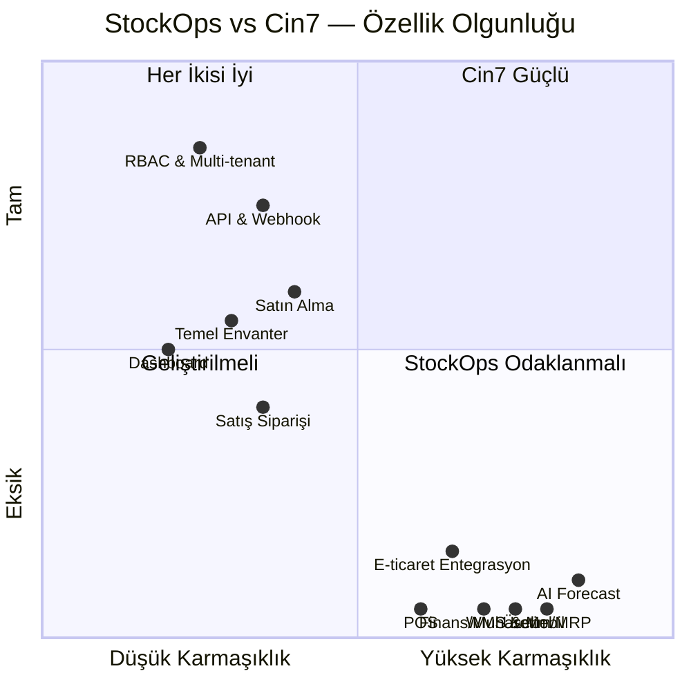

# StockOps vs Cin7 — Karşılaştırma Matrisi

> Bu doküman, StockOps (KernelGuard) projesini, $250M–$500M gelirli enterprise-seviye bir IMS olan **Cin7** ile karşılaştırmaktadır.

---

## 1. Genel Bakış

| Kriter | **StockOps** | **Cin7** |
|---|---|---|
| **Şirket / Proje** | KernelGuard — açık kaynak / startup | Cin7 Ltd. (Colorado, ABD) — 201-500 çalışan |
| **Gelir** | Pre-revenue / MVP aşaması | $250M – $500M |
| **Hedef Kitle** | KOBİ, tek-site stok takibi | KOBİ → Enterprise (omnichannel) |
| **Ürün Tipi** | Self-hosted monorepo | SaaS bulut platformu |
| **Ürün Alt Ürünleri** | Tek platform | Cin7 Core + Cin7 Omni + Cin7 Pay + ForesightAI |
| **Sektör Odağı** | Genel stok yönetimi | F&B, Moda, Sağlık/Güzellik, Üretim, Perakende, Toptan |
| **Fiyatlandırma** | Ücretsiz (self-hosted) | $349 – $999/ay + Omni = Özel fiyat |

---

## 2. Mimari & Teknoloji Karşılaştırması

| Kriter | **StockOps** | **Cin7** |
|---|---|---|
| **Mimari** | Monorepo (Turborepo) | Bulut SaaS (multi-tenant) |
| **Frontend** | Next.js (React, Server Actions) | Web dashboard (proprietary) |
| **Backend API** | NestJS (REST + OpenAPI/Swagger) | Java tabanlı REST API |
| **Database** | PostgreSQL + Prisma ORM | Microsoft SQL Server |
| **Queue/Worker** | Memory + BullMQ/Redis | Kurumsal message broker (bilinmiyor) |
| **Containerization** | Docker Compose (manuel) | Kubernetes (enterprise-grade) |
| **CI/CD** | Manuel (script tabanlı) | Otomatik CI/CD pipeline |
| **Güvenlik** | Bearer token + org izolasyonu, X-XSS-Protection yok | X-XSS-Protection, kurumsal güvenlik |
| **Mobil** | ❌ Yok (sadece responsive web) | ✅ WMS mobil app (barkod tarama) |
| **API Dokümantasyonu** | Swagger UI (localhost:4000/docs) | Halka açık REST API |

---

## 3. Modül Karşılaştırma Matrisi

### 3.1 Envanter & Stok Yönetimi

| Özellik | **StockOps** | **Cin7** |
|---|---|---|
| Ürün/SKU kaydı | ✅ | ✅ |
| Barkod desteği | ✅ (alan mevcut) | ✅ (barkod tarama + etiket basımı) |
| Kategori yönetimi | ✅ (tek seviye) | ✅ (çok seviyeli hiyerarşi) |
| Ürün varyantları (renk/beden) | ❌ | ✅ |
| Lot/Seri numarası takibi | ❌ | ✅ (batch + serial) |
| Son kullanma tarihi (expiry) | ❌ | ✅ |
| FIFO / LIFO / Ort. maliyet | ❌ | ✅ (FIFO, LIFO, Average, Specific Unit) |
| Minimum stok uyarısı | ✅ | ✅ |
| Otomatik yeniden sipariş önerisi | 🔲 (job kontratı var, implementasyon yok) | ✅ (otomatik reorder point) |
| Çoklu depo desteği | ✅ (Warehouse modeli) | ✅ (sınırsız lokasyon) |
| Depo-içi bin/raf yönetimi | ❌ | ✅ (bin management) |
| Depolar arası transfer | ✅ (TRANSFER hareket tipi) | ✅ |
| Stok sayımı (stocktake) | ❌ | ✅ (cycle count + full stocktake) |
| Negatif stok izni | ❌ (assertEnoughStock ile engellenir) | ✅ (yapılandırılabilir) |

### 3.2 Satış & Sipariş Yönetimi

| Özellik | **StockOps** | **Cin7** |
|---|---|---|
| Satış siparişi oluşturma | ✅ (DRAFT → CONFIRMED) | ✅ (Quote → SO → Pick → Pack → Ship → Invoice) |
| Müşteri kaydı | 🔲 (sadece customerName alanı) | ✅ (tam CRM modülü) |
| Fiyat listesi / indirim | ❌ | ✅ (çoklu fiyat listesi, hacim indirimi) |
| Kısmi sevkiyat | ❌ | ✅ |
| Backorder yönetimi | ❌ | ✅ |
| Faturalama | ❌ | ✅ (tam fatura döngüsü) |
| İade / iade faturası | ❌ | ✅ |
| B2B portal (toptan sipariş) | ❌ | ✅ |
| POS (point-of-sale) | ❌ | ✅ (entegre POS) |
| Dropshipping | ❌ | ✅ |

### 3.3 Satın Alma & Tedarik

| Özellik | **StockOps** | **Cin7** |
|---|---|---|
| Tedarikçi kaydı | ✅ | ✅ |
| Satın alma siparişi | ✅ (DRAFT → SENT → RECEIVED) | ✅ (tam PO döngüsü) |
| Kısmi teslimat | ✅ (PARTIALLY_RECEIVED durumu) | ✅ |
| Tedarik süresi (lead time) takibi | ✅ (leadTimeDays alanı) | ✅ |
| Tedarikçi fiyat karşılaştırma | ❌ | ✅ |
| Otomatik satın alma önerisi | 🔲 (job kontratı var) | ✅ (AI + rule-based) |
| Tedarikçi performans analizi | ❌ | ✅ |

### 3.4 Üretim (Manufacturing / MRP)

| Özellik | **StockOps** | **Cin7** |
|---|---|---|
| BOM (Bill of Materials) | ❌ | ✅ |
| Montaj / demontaj | ❌ | ✅ |
| Üretim planlama (Gantt) | ❌ | ✅ |
| Kapasite planlama | ❌ | ✅ |
| İş emri yönetimi | ❌ | ✅ |
| Hurda / fire takibi | ❌ | ✅ |

### 3.5 Depo Yönetimi (WMS)

| Özellik | **StockOps** | **Cin7** |
|---|---|---|
| Mobil barkod tarama uygulaması | ❌ | ✅ |
| Pick/Pack/Ship akışı | ❌ | ✅ |
| Wave picking | ❌ | ✅ |
| Bin/Raf konum yönetimi | ❌ | ✅ |
| 3PL entegrasyonu | ❌ | ✅ (çoklu 3PL) |

### 3.6 Entegrasyonlar

| Platform | **StockOps** | **Cin7** |
|---|---|---|
| Shopify | 🔲 (webhook iskelet) | ✅ (native, iki yönlü senkron) |
| WooCommerce | 🔲 (webhook iskelet) | ✅ (native) |
| Amazon | ❌ | ✅ |
| eBay | ❌ | ✅ |
| Magento | ❌ | ✅ |
| Lightspeed | ❌ | ✅ |
| Xero | ❌ | ✅ (iki yönlü muhasebe) |
| QuickBooks | ❌ | ✅ |
| EDI (Electronic Data Interchange) | ❌ | ✅ (Cin7 Omni) |
| Kargo firmaları | ❌ | ✅ (çoklu kargo) |
| Ödeme sistemi | ❌ | ✅ (Cin7 Pay) |
| Public REST API | ✅ (NestJS + OpenAPI) | ✅ |
| Webhook altyapısı | ✅ (idempotent inbox + worker) | ✅ |

### 3.7 Finans & Muhasebe

| Özellik | **StockOps** | **Cin7** |
|---|---|---|
| Fatura oluşturma | ❌ | ✅ |
| Ödeme takibi | ❌ | ✅ |
| Maliyet hesaplama | ❌ | ✅ (çoklu maliyet metodu) |
| Kar/zarar raporu | ❌ | ✅ |
| Banka mutabakatı | ❌ | ✅ |
| Sabit kıymet yönetimi | ❌ | ✅ |

### 3.8 Raporlama & AI

| Özellik | **StockOps** | **Cin7** |
|---|---|---|
| Dashboard | ✅ (kritik stok + sipariş özeti) | ✅ (kapsamlı dashboard) |
| Stok raporu | ✅ (stok satırları) | ✅ (detaylı çok boyutlu) |
| AI talep tahmini | 🔲 (job kontratı var) | ✅ (Cin7 ForesightAI) |
| Satış analitikleri | ❌ | ✅ |
| Özel rapor oluşturma | ❌ | ✅ |
| Dışa aktarma (CSV/Excel/PDF) | ❌ | ✅ |

### 3.9 Kullanıcı & Güvenlik

| Özellik | **StockOps** | **Cin7** |
|---|---|---|
| Çoklu organizasyon (multi-tenant) | ✅ | ✅ |
| Rol bazlı yetki (RBAC) | ✅ (6 rol, 6 izin) | ✅ (granüler izinler) |
| Audit log | ✅ | ✅ |
| API token yönetimi | ✅ | ✅ |
| SSO / SAML / OAuth | ❌ | ✅ |
| İki faktörlü doğrulama (2FA) | ❌ | ✅ |

---

## 4. Puan Matrisi (Kategorik Özet)

> **Puanlama**: ✅ Full = 3, 🔲 Kısmi/İskelet = 1, ❌ Yok = 0

| Kategori | **StockOps** | **Cin7** | Fark |
|---|:---:|:---:|:---:|
| Envanter & Stok | 6/42 | 42/42 | -36 |
| Satış & Sipariş | 3/30 | 30/30 | -27 |
| Satın Alma & Tedarik | 9/21 | 21/21 | -12 |
| Üretim (MRP) | 0/18 | 18/18 | -18 |
| Depo Yönetimi (WMS) | 0/15 | 15/15 | -15 |
| Entegrasyonlar | 8/36 | 33/36 | -25 |
| Finans & Muhasebe | 0/18 | 18/18 | -18 |
| Raporlama & AI | 7/18 | 18/18 | -11 |
| Kullanıcı & Güvenlik | 9/15 | 15/15 | -6 |
| **TOPLAM** | **42/213** | **210/213** | **-168** |
| **Yüzde** | **~20%** | **~99%** | |

---

## 5. StockOps'un Güçlü Yönleri (Cin7'ye Göre Avantajlar)

| Avantaj | Açıklama |
|---|---|
| 💰 **Sıfır maliyet** | Self-hosted, lisans ücreti yok (Cin7 min. $349/ay = ~$4,200/yıl) |
| 🏗️ **Tam kaynak kod kontrolü** | Monorepo, TypeScript, açık mimari — ihtiyaca göre özelleştirilebilir |
| 🔧 **Modern teknoloji yığını** | Next.js + NestJS + Prisma + PostgreSQL — developer-friendly |
| 📡 **OpenAPI-first API** | Swagger UI ile dokümante, genişletilebilir REST API |
| 🔌 **Webhook inbox pattern** | Idempotent event kaydı + queue job kontratı — production-grade altyapı |
| 🐳 **Container-ready** | Docker Compose ile hızlı kurulum |
| 🏢 **Multi-tenant temeli** | organizationId bazlı SaaS modeli çekirdekte hazır |
| 🧪 **Test altyapısı** | Vitest + integration test + smoke test |

---

## 6. StockOps'ta Eksik Olan Kritik Modüller & Yol Haritası Önerileri

### 🔴 Kritik Eksikler (MVP için gerekli)

| # | Eksik | Öncelik | Tahmini Efor |
|---|---|---|---|
| 1 | **Fiyat / birim fiyat alanı** (Product'ta ve sipariş satırında) | 🔴 Yüksek | 1-2 gün |
| 2 | **Müşteri (Customer) modeli** | 🔴 Yüksek | 2-3 gün |
| 3 | **Fatura oluşturma** | 🔴 Yüksek | 3-5 gün |
| 4 | **Ürün varyantları** (renk/beden/boyut) | 🟡 Orta | 3-5 gün |
| 5 | **Lot/Seri numarası takibi** | 🟡 Orta | 3-5 gün |
| 6 | **Maliyet hesaplama** (FIFO/Average) | 🟡 Orta | 3-5 gün |
| 7 | **Pick/Pack/Ship akışı** | 🟡 Orta | 5-7 gün |
| 8 | **CSV/Excel dışa aktarma** | 🟡 Orta | 1-2 gün |

### 🟡 Orta Vadeli (v1.0 için)

| # | Eksik | Tahmini Efor |
|---|---|---|
| 9 | BOM / basit üretim | 5-10 gün |
| 10 | Shopify/WooCommerce webhook işlemci (gerçek implementasyon) | 5-7 gün |
| 11 | Stok sayımı (stocktake) | 3-5 gün |
| 12 | B2B sipariş portalı | 10-15 gün |
| 13 | Kargo entegrasyonu (en az 1 firma) | 5-7 gün |

### 🔵 Uzun Vadeli (v2.0+ için)

| # | Özellik | Tahmini Efor |
|---|---|---|
| 14 | AI talep tahmini (ForesightAI benzeri) | 15-20 gün |
| 15 | POS modülü | 15-20 gün |
| 16 | Mobil WMS uygulaması | 20-30 gün |
| 17 | Muhasebe yazılımı entegrasyonu (Xero/QBO) | 10-15 gün |
| 18 | EDI desteği | 15-20 gün |

---

## 7. Sonuç & Stratejik Değerlendirme

> [!IMPORTANT]
> **StockOps**, temel stok takibi ve multi-tenant altyapı açısından sağlam bir **MVP çekirdeğine** sahip. Ancak Cin7'nin sunduğu özellik setinin yaklaşık **%20'sini** karşılıyor. Cin7 ile gerçekçi bir rekabet için ilk hedef, **fiyatlandırma, müşteri yönetimi, faturalama ve e-ticaret webhook implementasyonu** gibi temel ticari modüllerin tamamlanması olmalı.

> [!TIP]
> StockOps'un en büyük avantajı **sıfır lisans maliyeti** ve **tam kaynak kod kontrolü**. Cin7'nin yıllık minimum ~$4,200 maliyetini karşılayamayan KOBİ'ler için net bir değer önerisi sunuluyor. Strateji olarak "Cin7'nin tüm özelliklerini kopyalamak" yerine, **niş bir sektör** (örn: Türkiye KOBİ perakende) için **yeterli minimum özellik seti** sunmak daha gerçekçi bir yol haritası.
