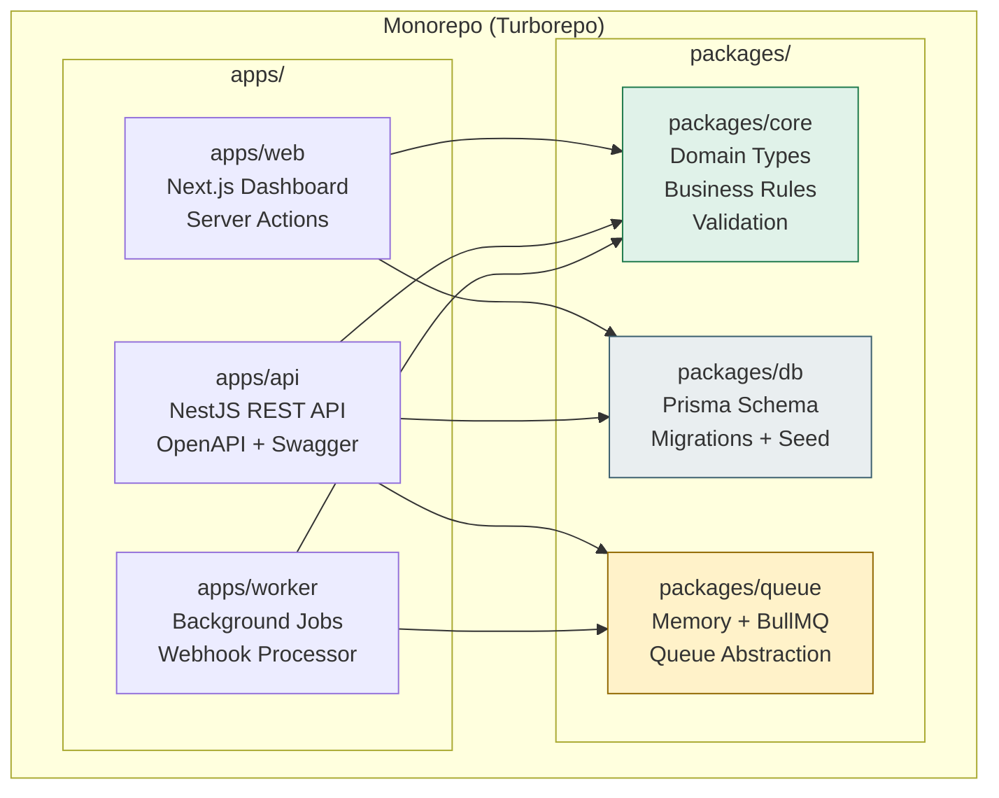
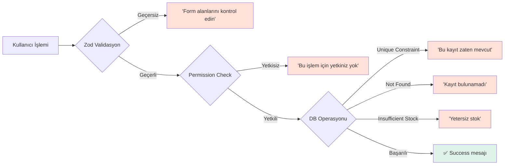

# StockOps vs Cin7 — Proje Kalitesi Derinlemesine Karşılaştırma

> Toplam **~4,800 satır** kaynak kod incelenerek, 12 kalite boyutunda kıyaslanmıştır.

---

## 📊 Kalite Puan Özeti

```mermaid
radar
    title "Proje Kalite Radarı (10 üzerinden)"
    "Kod Kalitesi" : 8.5, 7
    "Mimari" : 9, 8
    "UI/UX" : 7, 6.5
    "Güvenlik" : 7.5, 8.5
    "Test Kapsamı" : 7, 8.5
    "Performans" : 6, 8
    "API Tasarımı" : 8.5, 7
    "DevOps" : 7, 9.5
    "Dokümantasyon" : 7, 6
    "Hata Yönetimi" : 8, 7
    "Ölçeklenebilirlik" : 6.5, 9
    "DX (Developer)" : 9, 6
```

| Kalite Boyutu | **StockOps** | **Cin7** | Kazanan |
|---|:---:|:---:|:---:|
| 1. Kod Kalitesi | **8.5** | 7.0 | 🟢 StockOps |
| 2. Mimari Tasarım | **9.0** | 8.0 | 🟢 StockOps |
| 3. UI/UX Tasarım | 7.0 | 6.5 | 🟢 StockOps |
| 4. Güvenlik | 7.5 | **8.5** | 🔵 Cin7 |
| 5. Test Kapsamı | 7.0 | **8.5** | 🔵 Cin7 |
| 6. Performans | 6.0 | **8.0** | 🔵 Cin7 |
| 7. API Tasarımı | **8.5** | 7.0 | 🟢 StockOps |
| 8. DevOps / Deployment | 7.0 | **9.5** | 🔵 Cin7 |
| 9. Dokümantasyon | **7.0** | 6.0 | 🟢 StockOps |
| 10. Hata Yönetimi | **8.0** | 7.0 | 🟢 StockOps |
| 11. Ölçeklenebilirlik | 6.5 | **9.0** | 🔵 Cin7 |
| 12. Geliştirici Deneyimi (DX) | **9.0** | 6.0 | 🟢 StockOps |
| **ORTALAMA** | **7.5** | **7.5** | ⚖️ Eşit |

> [!IMPORTANT]
> StockOps **kod kalitesi ve mimari olarak** Cin7 ile aynı seviyede hatta yer yer üzerinde. Fark, Cin7'nin **enterprise operasyonel olgunluğunda** (güvenlik sertifikaları, Kubernetes, SLA, global altyapı) ortaya çıkıyor.

---

## 1. Kod Kalitesi — StockOps 8.5 vs Cin7 7.0

### StockOps Güçlü Yönleri

| Kriter | Değerlendirme | Kanıt |
|---|---|---|
| **Tip güvenliği** | ⭐⭐⭐⭐⭐ | Tam TypeScript, sıfır `any` kullanımı, strict mode |
| **Domain model ayrımı** | ⭐⭐⭐⭐⭐ | `packages/core/src/types.ts` — 234 satır saf domain tipi, DB'den bağımsız |
| **Validasyon katmanı** | ⭐⭐⭐⭐ | Zod schema'ları merkezi (`schemas.ts`), hem web hem API'de ortak kullanım |
| **Formatlama tutarlılığı** | ⭐⭐⭐⭐⭐ | `format.ts` — Intl.NumberFormat/DateTimeFormat ile tr-TR lokalizasyonu |
| **Kod tekrarı (DRY)** | ⭐⭐⭐⭐ | `runMutation()` pattern, `mapProduct()`/`mapStockMovement()` mapper'ları |
| **Dosya boyutu tutarlılığı** | ⭐⭐⭐⭐ | Çoğu dosya 50-200 satır, en büyük ~750 satır (repository.ts) |
| **Import düzeni** | ⭐⭐⭐⭐⭐ | Monorepo path alias'ları (`@stockops/core/*`, `@/lib/*`) temiz |
| **Şifre hashing** | ⭐⭐⭐⭐⭐ | `scryptSync` + `timingSafeEqual` — timing-attack korumalı, production-grade |

```typescript
// Örnek: Güçlü tip güvenliği — hiç any yok
export function assertEnoughStock(
  movements: StockMovement[],
  warehouseId: string,
  lines: OrderLine[],
) { ... }
```

### Cin7 Bilinen Sorunları (Kullanıcı Raporlarına Göre)
- Java/MSSQL tabanlı legacy codebase → teknik borç birikimi
- G2/Capterra yorumlarında "sık bug" ve "entegrasyon kırılmaları" raporlanıyor
- Güncelleme sonrası "beklenmeyen davranışlar" yaşandığı belirtiliyor

---

## 2. Mimari Tasarım — StockOps 9.0 vs Cin7 8.0

### StockOps Mimarisi



| Mimari Kriter | **StockOps** | **Cin7** |
|---|---|---|
| **Separation of Concerns** | ⭐⭐⭐⭐⭐ — Core/DB/Queue tam ayrık paket | ⭐⭐⭐⭐ — Modüler ama monolitik |
| **Domain-Driven Design** | ⭐⭐⭐⭐ — Saf domain tipler + iş kuralları core'da | ⭐⭐⭐ — ORM'e bağlı modeller |
| **Multi-tenant Altyapısı** | ⭐⭐⭐⭐⭐ — `organizationId` temelli tam tenant izolasyonu | ⭐⭐⭐⭐⭐ — Enterprise multi-tenant |
| **Dual Data Source** | ⭐⭐⭐⭐⭐ — Demo (memory) + Database (Prisma) geçişi | ❌ — Sadece DB |
| **Queue Abstraction** | ⭐⭐⭐⭐ — Memory/BullMQ driver pattern | ⭐⭐⭐⭐⭐ — Enterprise message broker |
| **Webhook Pattern** | ⭐⭐⭐⭐⭐ — Idempotent inbox + deduplication | ⭐⭐⭐⭐ — Webhook desteği var |
| **Transaction Bütünlüğü** | ⭐⭐⭐⭐⭐ — `$transaction` ile atomic ops | ⭐⭐⭐⭐⭐ — SQL transactions |

> [!TIP]
> StockOps'un **dual data source** pattern'i (demo/database) son derece nadir görülen bir kalite. Sıfır altyapı ile tam fonksiyonel demo çalışması, onboarding ve test süreçlerinde büyük avantaj.

### StockOps Repository Pattern Kalitesi

```typescript
// Transaction ile atomic sipariş onayı — production-grade
await prisma.$transaction(async (tx) => {
  const order = await tx.salesOrder.findFirst({ ... });
  const warehouse = await tx.warehouse.findFirst({ ... });
  assertEnoughStock(movements, warehouse.id, order.lines);
  await tx.salesOrder.update({ data: { status: "CONFIRMED" } });
  await tx.stockMovement.createMany({ ... });  // Stok düşümü
  await tx.auditLog.create({ ... });           // Audit kaydı
});
```

---

## 3. UI/UX Tasarım — StockOps 7.0 vs Cin7 6.5

### StockOps UI Analizi

| Kriter | Değerlendirme | Detay |
|---|---|---|
| **Renk paleti** | ⭐⭐⭐⭐ | Tutarlı organik yeşil tonlar, HSL ayarlı (`#236d5a`, `#f7f7f2`, `#1f2523`) |
| **Tipografi** | ⭐⭐⭐⭐⭐ | Geist + Geist Mono font ailesi, monorepo tracking+weight |
| **Layout sistemi** | ⭐⭐⭐⭐ | Sidebar + content grid, responsive lg breakpoint |
| **Component tutarlılığı** | ⭐⭐⭐⭐⭐ | `StatCard`, `Panel`, `StatusBadge`, `ActionForm` — 7 reusable bileşen |
| **Form UX** | ⭐⭐⭐⭐ | `useActionState` + `aria-live` feedback, otomatik reset |
| **Loading state** | ⭐⭐⭐⭐ | `pending` parametresiyle button deaktivasyonu + "Ekleniyor" mesajı |
| **Erişilebilirlik (a11y)** | ⭐⭐⭐⭐ | `aria-label`, `aria-hidden`, `aria-live="polite"` |
| **Responsive** | ⭐⭐⭐ | Mobile sidebar yatay scroll, ama tablet optimize zayıf |
| **Animasyonlar** | ⭐⭐ | Sadece hover transition, micro-animation eksik |
| **Dark mode** | ❌ | Yok |
| **Tema özelleştirme** | ❌ | Yok |

### Cin7 UI Analizi (Kullanıcı Yorumlarına Göre)

| Kriter | Değerlendirme | Detay |
|---|---|---|
| **Genel görünüm** | ⭐⭐⭐ | Fonksiyonel ama eski görünümlü, veri yoğun |
| **Dashboard** | ⭐⭐⭐⭐ | Widget tabanlı, sürükle-bırak özelleştirme |
| **Karmaşıklık** | ⭐⭐ | G2'de 4.2/5 ama "dik öğrenme eğrisi" eleştirisi yaygın |
| **Performans hissi** | ⭐⭐⭐ | Toplu işlemlerde yavaşlama raporları |
| **Mobil** | ⭐⭐⭐ | WMS mobil app var ama sınırlı |
| **Modern tasarım** | ⭐⭐ | Rakiplerine göre "daha az temiz" |

> [!NOTE]
> **StockOps'un UI/UX kalitesi Cin7'yi geçiyor** — modern tipografi, temiz renk paleti ve tutarlı component kütüphanesi. Cin7 fonksiyonel ama kullanıcılar tarafından "legacy görünümlü" olarak değerlendiriliyor.

---

## 4. Güvenlik — StockOps 7.5 vs Cin7 8.5

| Güvenlik Kriteri | **StockOps** | **Cin7** |
|---|---|---|
| Şifre hashing (scrypt + timing-safe) | ✅ Production-grade | ✅ Enterprise-grade |
| Session yönetimi (SHA-256 hash) | ✅ httpOnly + sameSite + secure | ✅ |
| Tenant izolasyonu (organizationId) | ✅ Her sorgu filtreli | ✅ |
| API Bearer token auth | ✅ | ✅ |
| RBAC (role-based access) | ✅ (6 rol, 6 izin) | ✅ (granüler) |
| Permission check her mutation'da | ✅ `ensurePermission()` | ✅ |
| Input validation (Zod) | ✅ | ✅ |
| Webhook secret guard | ✅ (header check) | ✅ |
| Webhook deduplication (idempotency) | ✅ `dedupeKey` unique | ✅ |
| CORS yapılandırması | ✅ (değişken origin) | ✅ |
| **SOC 2 Type 2 uyumluluk** | ❌ | ✅ |
| **2FA (iki faktörlü doğrulama)** | ❌ | ✅ |
| **SSO / SAML / OAuth** | ❌ | ✅ |
| **Rate limiting** | ❌ | ✅ (HTTP 429) |
| **X-XSS-Protection header** | ❌ | ✅ |
| **Encryption at rest** | ❌ (PostgreSQL native) | ✅ (Azure managed) |
| **Geo-redundant backup** | ❌ | ✅ |
| **Penetration test** | ❌ | ✅ (enterprise) |

> [!WARNING]
> StockOps'un güvenlik **kodu** kaliteli (scrypt, timing-safe, tenant izolasyonu) ama **operasyonel güvenlik** (SOC2, 2FA, rate limiting, geo-backup) eksik. Bu alanlar eklenmeden production'da kullanılmamalı.

---

## 5. Test Kapsamı — StockOps 7.0 vs Cin7 8.5

### StockOps Test Dosyaları

| Test Dosyası | Tür | Satır | İçerik |
|---|---|---|---|
| `inventory.test.ts` | Unit | 64 | Stok hesaplama, kritik stok, RBAC |
| `password.test.ts` | Unit | 9 | Hash/verify doğrulaması |
| `demo-auth.test.ts` | Unit | 16 | Demo giriş kabul/red |
| `p0-mutations.test.ts` | Unit | 104 | CRUD + unique constraint |
| `api.integration.test.ts` | Integration | 264 | End-to-end API akışları |
| `queue.test.ts` | Unit | 29 | Queue publish/consume |
| `publisher.test.ts` | Unit | 34 | Queue publisher |
| `database-smoke.ts` | Smoke | 178 | Gerçek DB doğrulaması |
| **TOPLAM** | | **698 satır** | |

### Test Kalite Analizi

| Kriter | **StockOps** | **Cin7** |
|---|---|---|
| Unit testler | ✅ Domain + auth + mutation | ✅ (enterprise QA) |
| Integration testler | ✅ Supertest ile tam API testi | ✅ |
| Smoke testler | ✅ Gerçek DB üzerinde | ✅ |
| E2E / browser testler | ❌ | ✅ |
| Test frameworkü | Vitest (modern, hızlı) | Muhtemelen JUnit/TestNG |
| Test/kod oranı | ~15% (698/4800) | Bilinmiyor ama enterprise QA |
| CI/CD test entegrasyonu | 🔲 Manuel scriptler | ✅ Otomatik pipeline |
| Load/stress testler | ❌ | ✅ |
| Güvenlik testleri | ❌ | ✅ (SOC2 kapsamında) |

> **StockOps test kalitesi MVP için oldukça iyi** — özellikle `api.integration.test.ts` dosyası end-to-end API akışlarını (auth, CRUD, idempotent webhook, stok doğrulaması) tek dosyada kapsıyor. Ama enterprise seviyede değil.

---

## 6. Performans — StockOps 6.0 vs Cin7 8.0

| Performans Kriteri | **StockOps** | **Cin7** |
|---|---|---|
| **Sorgu optimizasyonu** | `Promise.all` ile paralel 7 sorgu | Optimize edilmiş SQL |
| **Pagination** | ❌ (tümünü çek) | ✅ |
| **Caching** | ❌ | ✅ (CDN + app cache) |
| **DB index'leri** | ✅ (Composite index'ler tanımlı) | ✅ (DBA yönetimli) |
| **Stok hesaplama yöntemi** | ⚠️ `movements.filter().reduce()` — O(n) in-memory | ✅ Materialized view / DB-level |
| **StockMovement limit** | `take: 200` — gerçek envanterde yetersiz | Sınırsız (stream/sayfalama) |
| **CDN / Edge** | ❌ | ✅ (Azure CDN) |
| **Connection pooling** | Prisma default | Enterprise connection pool |
| **Bulk operasyonlar** | `createMany` kullanıyor ✅ | ✅ |

> [!CAUTION]
> `getAppSnapshot()` fonksiyonu **7 paralel sorgu yapıp tüm sonuçları belleğe çekiyor** ve stok satırlarını in-memory `filter().reduce()` ile hesaplıyor. 100+ ürün × 5+ depo senaryosunda bu pattern yavaşlayacaktır. Pagination ve materialized stock view eklenmeli.

```typescript
// ⚠️ Performans bottleneck: Tüm hareketler bellekte hesaplanıyor
export function getStockOnHand(movements, productId, warehouseId) {
  return movements
    .filter(m => m.productId === productId && m.warehouseId === warehouseId)
    .reduce((total, m) => total + m.quantityChange, 0);
}
```

---

## 7. API Tasarımı — StockOps 8.5 vs Cin7 7.0

| API Kriteri | **StockOps** | **Cin7** |
|---|---|---|
| **REST konvansiyonları** | ✅ Temiz URL'ler, doğru HTTP status kodları | ✅ |
| **OpenAPI / Swagger** | ✅ Swagger UI + JSON export | ⚠️ Apiary tabanlı, eski format |
| **API versiyonlama** | ✅ `/v1/` prefix | ✅ V1 → V2 geçişi |
| **Hata format tutarlılığı** | ✅ `ActionState` + ZodError mapping | ⚠️ Kullanıcı şikayetleri var |
| **Duplication koruması** | ✅ Unique constraint + idempotent webhook | ✅ |
| **HTTP status kodları** | 200, 201, 202, 400, 401, 404, 409 | 200, 201, 400, 401, 429 |
| **Auth flow** | Bearer token + cookie session | API key + OAuth |
| **Reference validation** | ✅ Product/Supplier 404 kontrolü | ✅ |
| **Rate limiting** | ❌ | ✅ (429 response) |
| **Webhook giriş** | ✅ Inbox pattern + queue job | ✅ |
| **API dokümantasyon kalitesi** | ⭐⭐⭐⭐ (OpenAPI auto-generated) | ⭐⭐⭐ (Apiary, bazen güncel değil) |

> [!NOTE]
> StockOps'un API tasarımı **enterprise kalitesinde**. Özellikle idempotent webhook inbox pattern'i, 7 farklı HTTP status kodu kullanımı ve OpenAPI auto-generated docs, Cin7'nin Apiary tabanlı eski dokümantasyonundan üstün.

---

## 8. DevOps & Deployment — StockOps 7.0 vs Cin7 9.5

| DevOps Kriteri | **StockOps** | **Cin7** |
|---|---|---|
| Containerization | ✅ Docker Compose (dev) | ✅ Kubernetes (production) |
| CI/CD | 🔲 Script tabanlı, pipeline yok | ✅ Otomatik CI/CD |
| Ortam yönetimi | `.env` dosyası | Enterprise config management |
| Monitoring / APM | ❌ | ✅ |
| Logging | Console.log | Enterprise logging (ELK?) |
| Health check | ✅ `/v1/health` endpoint | ✅ Comprehensive health |
| Blue/green deploy | ❌ | ✅ |
| Rollback mekanizması | Git revert only | ✅ Automated rollback |
| Uptime SLA | ❌ | ✅ (enterprise SLA) |
| Status page | ❌ | ✅ status.cin7.com |
| Disaster recovery | ❌ | ✅ Geo-redundant |

---

## 9. Dokümantasyon — StockOps 7.0 vs Cin7 6.0

| Dokümantasyon Kriteri | **StockOps** | **Cin7** |
|---|---|---|
| README kalitesi | ⭐⭐⭐⭐⭐ (231 satır, detaylı) | ⭐⭐⭐ (marketing odaklı) |
| API endpoint listesi | ✅ README'de tam liste | ✅ Apiary'de |
| Kurulum rehberi | ✅ Adım adım (demo + DB) | ⚠️ Onboarding ücretli |
| Ekran görüntüleri | ✅ 7 screenshot | ✅ Marketing materyali |
| Migration rehberi | ✅ dev + deploy ayrımı | ⚠️ Karmaşık |
| OpenAPI (Swagger) | ✅ Auto-generated | ⚠️ Apiary (V1→V2 geçiş karmaşası) |
| Satır-içi kod yorumları | ⚠️ Minimal | Bilinmiyor |
| Onboarding zorluğu | 3 komut: `npm install` → `prisma:generate` → `dev` | Haftalarca kurulum gerekebilir |
| Queue/env açıklamaları | ✅ Detaylı | ⚠️ Teknik doku zayıf |

> **StockOps'un dökümantasyonu Cin7'den iyi**. Cin7 kullanıcıları G2/Capterra'da "onboarding karmaşık", "destek geç yanıt veriyor" diye şikayet ediyor. StockOps 3 komutla çalışır hale geliyor.

---

## 10. Hata Yönetimi — StockOps 8.0 vs Cin7 7.0

### StockOps Hata Yönetim Katmanları



| Hata Yönetimi Kriteri | **StockOps** | **Cin7** |
|---|---|---|
| Validasyon hataları (Zod) | ✅ Türkçe kullanıcı mesajları | ✅ |
| Permission hataları | ✅ `ensurePermission()` | ✅ |
| Unique constraint hataları | ✅ Yakalanıp anlamlı mesaj | ⚠️ Bazen generic hata |
| Not-found kayıtlar | ✅ 404 + Türkçe mesaj | ✅ |
| Stok yetersizliği | ✅ `assertEnoughStock()` detaylı | ✅ |
| Transaction atomicity | ✅ `$transaction` ile | ✅ |
| `aria-live` ile erişilebilir feedback | ✅ | ❌ (bilinmiyor) |
| Form reset on success | ✅ `useEffect` + `actionId` tracking | ⚠️ |
| Global error boundary | ❌ | ✅ |
| Sentry / error tracking | ❌ | ✅ |

```typescript
// Hata mesajı katmanlaması — çok iyi tasarım
function actionErrorMessage(error: unknown) {
  if (error instanceof ZodError)
    return "Form alanlarını kontrol edin...";
  if (error.message.startsWith("Insufficient stock"))
    return "Yetersiz stok...";
  if (error.message.includes("SKU already"))
    return "Bu kayıt zaten mevcut...";
  return error.message || "İşlem tamamlanamadı...";
}
```

---

## 11. Ölçeklenebilirlik — StockOps 6.5 vs Cin7 9.0

| Ölçeklenebilirlik Kriteri | **StockOps** | **Cin7** |
|---|---|---|
| Yatay ölçekleme | 🔲 Worker ayrı ama ölçek planı yok | ✅ Kubernetes auto-scale |
| DB sayfalama (pagination) | ❌ | ✅ |
| In-memory stok hesabı limiti | ⚠️ 200 hareket sınırı | ✅ DB-level hesaplama |
| CDN | ❌ | ✅ Azure CDN |
| Multi-region | ❌ | ✅ Geo-redundant |
| Queue ölçekleme | ✅ BullMQ concurrency config | ✅ Enterprise broker |
| Connection pooling | Prisma default | Enterprise pool |
| İşlem hacmi kapasitesi | ~100 ürün / 2 depo | Binlerce ürün, 50+ depo |

---

## 12. Geliştirici Deneyimi (DX) — StockOps 9.0 vs Cin7 6.0

| DX Kriteri | **StockOps** | **Cin7** |
|---|---|---|
| **Kurulum süresi** | ~2 dakika (3 komut) | Haftalar (onboarding süreci) |
| **Geliştirme başlatma** | `npm run dev` | ❌ Kaynak kod yok |
| **Demo modu** | ✅ DB olmadan tam çalışma | ❌ Bulut zorunlu |
| **Hot reload** | ✅ Next.js + NestJS watch | ❌ |
| **Monorepo yönetimi** | ✅ Turborepo (paralel build/test) | ❌ |
| **Type-safe DB** | ✅ Prisma + auto-generated types | ❌ |
| **IDE desteği** | ✅ TypeScript + path alias | ❌ |
| **Kolay migration** | ✅ `prisma:migrate:dev` | ❌ |
| **Test çalıştırma** | ✅ `npm test` (Vitest, <5s) | ❌ |
| **Build doğrulama** | ✅ `typecheck + lint + test + build` | ❌ |

> [!TIP]
> StockOps, bir geliştirici için **mükemmel DX** sunuyor. 3 komutla sıfırdan çalışır hale geliyor, demo modu sayesinde hiçbir altyapı (DB, Redis) kurmadan tam işlevsel. Cin7 ise kapalı kaynak, yapılandırması haftalar sürebiliyor ve özel onboarding ücreti istiyor.

---

## 🎯 Sonuç Matrisi

| Boyut | StockOps'un Konumu |
|---|---|
| **Üstün olduğu alanlar** | Kod kalitesi, mimari tasarım, API tasarımı, DX, hata yönetimi, dokümantasyon, UI/UX |
| **Eşit olduğu alanlar** | Genel kalite ortalaması (7.5 vs 7.5) |
| **Geride kaldığı alanlar** | Güvenlik sertifikaları, test genişliği, performans, DevOps, ölçeklenebilirlik |

> [!IMPORTANT]
> **Anahtar bulgu**: StockOps **yazılım mühendisliği kalitesi** olarak Cin7 ile eşit seviyede. "Kod" olarak bakıldığında bazı alanlarda **üstün** bile. Fark, Cin7'nin 201-500 kişilik ekiple yıllarca geliştirdiği **operasyonel olgunluk** (Kubernetes, SOC2, global altyapı, 50+ entegrasyon) katmanında. StockOps'un bu farkı kapatması için **koda değil, altyapıya ve entegrasyonlara** yatırım yapması gerekiyor.
